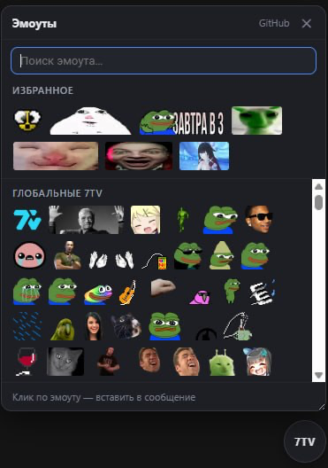

# VK7TV — эмоуты 7TV во ВКонтакте

Расширение для Chrome: слова-коды в сообщениях и ленте ВК заменяются на
анимированные эмоуты из наборов [7TV](https://7tv.app).

Пишешь другу `peepoHappy` — у всех с расширением вместо слова рендерится
гифка. На сервере ВК остаётся обычный текст: у кого расширения нет, тот
видит слово. Ничего особенного при отправке не нужно.

## Содержание

- [Как это работает](#как-это-работает)
- [Установка](#установка)
- [Обновление](#обновление)
- [Наборы стримеров](#наборы-стримеров)
- [Общий набор с друзьями](#общий-набор-с-друзьями)
- [Zero-width эмоуты](#zero-width-эмоуты)
- [Автозаполнение](#автозаполнение)
- [Виджет-пикер на странице](#виджет-пикер-на-странице)
- [Попап](#попап)
- [Ограничения](#ограничения)
- [Приложение ВК на Android](#приложение-вк-на-android)
- [Файлы](#файлы)

## Как это работает

- Наборы эмоутов живут на 7tv.app — там их создаёшь и редактируешь.
- Расширение тянет их через API `7tv.io/v3/emote-sets/{id}` и кэширует
  локально. Кэш обновляется только по кнопке «↻ Обновить наборы» в попапе:
  наборы меняются редко, проверять их при каждом запуске браузера незачем.
  Минус — новые эмоуты владельца сами не приедут.
- Контент-скрипт на vk.com / web.vk.me находит коды в тексте и заменяет
  их на картинки с CDN 7TV.
- Из коробки — только глобальный набор 7TV (~45 эмоутов). Наборы
  стримеров добавляешь сам в попапе: по ссылке на набор или по нику
  с Twitch.

## Установка

1. Скачай архив со [страницы релизов](https://github.com/Spudisis/7tv-vk/releases).
2. Распакуй — внутри папка `vk7tv`. Положи её насовсем: удалишь,
   переименуешь или перенесёшь — расширение отвалится.
3. Открой `chrome://extensions` (в Яндекс Браузере — `browser://extensions`).
4. Включи «Режим разработчика» (справа сверху).
5. «Загрузить распакованное расширение» → выбери папку `vk7tv`.

## Обновление

**Не удаляй расширение** — браузер вместе с ним сотрёт наборы, свои эмоуты
и настройки.

1. Скачай новый архив с той же страницы релизов.
2. Распакуй **поверх старой папки** `vk7tv`, заменив файлы.
3. В `chrome://extensions` нажми «Обновить» (↻) на карточке.

Наборы остаются на месте, потому что папка всегда называется `vk7tv`, без
номера версии: у распакованного расширения ID берётся из пути к папке, и
папка с другим именем стала бы для браузера другим расширением с пустым
хранилищем.

Переустановка с нуля или переезд на другой компьютер — через «Резервная
копия настроек» в попапе: «Сохранить в файл» до удаления, «Загрузить из
файла» после. Эмоуты наборов в файл не пишутся — докачиваются из API 7TV
по id.

**Ошибка «Не удалось загрузить JavaScript … для скрипта содержимого»** —
в папке не хватает файла из `manifest.json` (обычно от обновления по
частям). Собери архив целиком: `./build.sh` проверит комплектность и
положит `dist/vk7tv-<версия>.zip`.

## Наборы стримеров

Впиши в попапе ник стримера с Twitch (`bratishkinoff`, `5opka`) — его
активный набор 7TV подключится целиком. Ник резолвится в Twitch ID через
api.ivr.fi, запасной путь — поиск в GQL самого 7TV.

**Постфикс.** У каждого эмоута набора есть второе имя — с постфиксом (ник
владельца набора на 7TV): `ok` работает и как `ok_bratishkinoff`. Постфикс
виден в попапе рядом с названием набора.

Кому достаётся голое имя (`ok` без постфикса):

- глобальному набору и «своим» эмоутам — всегда;
- набору стримера — если код есть в одном наборе; а при коллизии (код в
  нескольких) — набору, чей постфикс первый по алфавиту, чтобы у вас с
  другом под одним словом была одна и та же картинка.

Хочешь конкретный вариант — пиши с постфиксом. Пикер всегда вставляет
полное имя с постфиксом; автозаполнение показывает такие имена, когда в
слове есть `_`.

**Предложение подключить набор.** Прилетело слово с постфиксом, а набора
нет — правее слова появляется чип с превью и кнопкой «+ ник». Жмёшь — набор
подключается, слово превращается в картинку во всех сообщениях на странице.

Кандидат — слово `имя_ник` из латиницы, цифр и подчёркиваний. Где кончается
имя и начинается ник, заранее не ясно (`SEXALARM_kanba_mx` → стример
`kanba_mx`), поэтому разделители перебираются слева направо (до трёх) и
берётся первый, что сходится по API: и стример есть, и эмоут в его наборе
лежит. Регистр важен. Ответы (в том числе «не нашлось») кэшируются — API
дёргается на слово один раз. Выключается галкой «Предлагать наборы
стримеров в чате».

## Общий набор с друзьями

1. Зарегистрируйся на [7tv.app](https://7tv.app) (вход через Twitch или Discord).
2. Создай emote set и накидай эмоутов.
3. Скопируй ссылку набора (`https://7tv.app/emote-sets/01ABC…`).
4. Каждый друг вставляет ссылку в попап → «Добавить».

Все с этим набором видят одинаковые эмоуты. Новый эмоут владельца приедет
после «↻ Обновить наборы» — сам кэш не обновляется.

## Zero-width эмоуты

Эмоуты с флагом zero-width (RainTime, PETPET, SteerR…) не занимают своё
место, а накладываются поверх предыдущего: `peepoHappy RainTime` — это
peepoHappy под дождём. Можно стакать несколько поверх одного. Zero-width
без эмоута перед ним рендерится как обычный.

## Автозаполнение

Как на Twitch: набери в поле ввода 3+ символа имени (регистр не важен) —
всплывёт панель с вариантами. Стрелки — выбор, Tab/Enter/клик — вставить,
Esc — закрыть.

## Виджет-пикер на странице

  

В углу страницы ВК — круглая кнопка «7TV». Клик раскрывает поповер: поиск и
все подключённые эмоуты по наборам. Клик по эмоуту вставляет полное имя с
постфиксом в последнее активное поле ввода (курсор запоминается); если поле
не открыто — имя копируется в буфер.

Зажми эмоут — он всплывёт крупно (версия 4x) вместе с именем: в сетке 32px
похожие варианты не различить, а так видно, что берёшь. Отпустил — превью
пропало, и такое нажатие ничего не вставляет.

**Избранное.** Наведи на эмоут — в углу появится звёздочка. Клик закрепляет
его в полосе «Избранное» над списком: она не уезжает при прокрутке. Ещё
клик по звезде — убрать. Полоса максимум в две строки, дальше прокручивается
сама, так что поповер не разрастается. Избранное синхронизируется вместе с
настройками и попадает в резервную копию.

Кнопку можно перетаскивать (за неё или за шапку поповера), поповер —
ресайзить за правый нижний угол; позиция и размер запоминаются. Отключается
галкой «Виджет-пикер на странице».

## Попап

- Вкл/выкл расширения.
- Подключение/отключение наборов 7TV по ссылке или нику.
- «Показывать эмоуты везде» — по умолчанию коды заменяются только в разделе
  «Мессенджер» и диалогах; включи, чтобы эмоуты были и в ленте, на стене,
  в комментариях.
- «Предлагать наборы стримеров в чате».
- Свои эмоуты вручную (имя + прямая ссылка на гифку) — если чего-то нет на 7TV.
- Сетка всех активных эмоутов с поиском; клик по эмоуту копирует его имя.

## Ограничения

- Эмоут — отдельное слово с пробелами по краям, регистр важен (`peepoHappy`
  да, `peepohappy` и `peepoHappy,` — нет). Так же работает сам 7TV.
- Картинки видят только те, у кого стоит расширение, — остальные видят текст.
- Меняется только текст сообщений и постов. Служебные подписи ВК — время,
  `(ред.)`, дата поста, «был в сети…» — не трогаются: в наборах попадаются
  эмоуты с именами `20:00`, `(`, `)`, иначе они подменяли бы их. Цена —
  сообщение ровно из `20:00` останется текстом; внутри фразы (`созвон 20:00`)
  эмоут рисуется как обычно.
- Только браузер (vk.com, web.vk.me). Для приложения ВК на Android есть
  отдельный модуль — см. ниже.
- CSP ВК блокирует прямую загрузку картинок с cdn.7tv.app, поэтому их
  качает фоновый скрипт и отдаёт странице как blob:-URL (blob: и data: у ВК
  разрешены). Скачанное лежит в Cache API и переживает засыпание воркера,
  иначе каждая перезагрузка страницы качала бы картинки заново.

## Приложение ВК на Android

Расширение — это код в браузере, а в приложении ВК браузера нет. Для
телефона есть **модуль**: он цепляется к процессу ВК и делает то же самое —
подменяет коды на картинки и добавляет свою кнопку-пикер в панель ввода.

Рут не нужен. Android не пускает одно приложение в процесс другого, это
обходится через [LSPatch](https://github.com/JingMatrix/LSPatch): он
дописывает в APK ВКонтакте загрузчик модуля, не трогая код самого ВК. Плата
— обновления ВК ставишь вручную; зато всё обратимо: поставил обычный ВК из
Play Store — и телефон как был.

**Способ 1 — установщик (рекомендуется).** Отдельное приложение с одной
кнопкой. Ставишь его APK, жмёшь «Пропатчить», подтверждаешь пару системных
диалогов — готово. Свежий модуль он тянет с GitHub сам и себя обновляет
сам. Никаких Shizuku, беспроводной отладки и файловых менеджеров.

**Способ 2 — вручную (если не доверяешь установщику).** Патчишь APK ВК сам
через LSPatch + Shizuku и ставишь модуль руками. Дольше и муторнее, зато
контролируешь каждый шаг. Пошагово — в [`android/README.md`](android/README.md).

Настройки заводить заново не надо: модуль импортирует тот же файл, что
отдаёт «Резервная копия настроек» в попапе. Наборы, свои эмоуты и избранное
приезжают на телефон одним файлом — и вы с другом видите одинаковые картинки
под одним словом на десктопе и на телефоне.

Подробности и что ломается при обновлении ВК — в
[`android/README.md`](android/README.md).

## Файлы

- `manifest.json` — MV3-манифест.
- `content.js` / `content.css` — замена слов на эмоуты.
- `autocomplete.js` — автозаполнение эмоутов при наборе (Twitch-стиль).
- `picker.js` / `picker.css` — перетаскиваемый виджет-пикер на странице.
- `background.js` — загрузка наборов из API 7TV, кэш картинок.
- `popup/` — интерфейс управления, там же резервная копия настроек.
- `default-emotes.js` — снапшот глобального набора 7TV.
- `android/` — модуль для приложения ВК (в архив расширения не входит).

---

  

